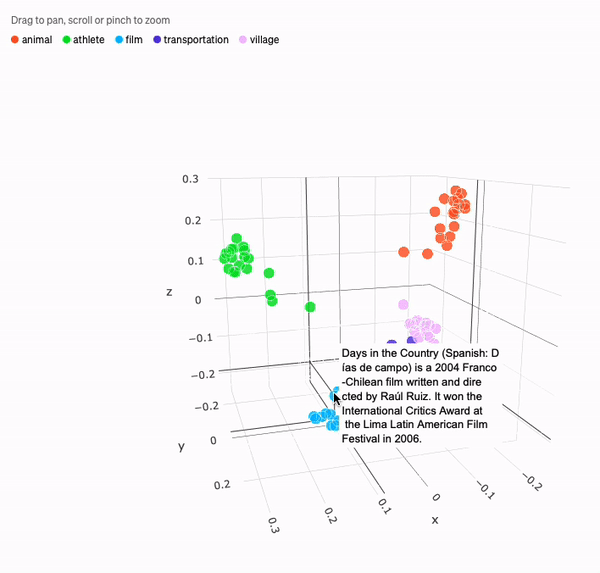

# OpenAi Text Embedding

<h4>What is  OpenAI</h4>
[OpenAI](https://openai.com) is an organization that develops advanced AI technologies for the benefit of humanity. GPT is a language model developed by OpenAI that can process and generate human-like text. ChatGPT is a version of GPT specifically designed for conversational interactions with humans.
<hr>


#### Embedding
Text embedding is the process of converting words or sentences into a numerical representation that can be used as input to machine learning algorithms. OpenAI provides various language models that can be used for text embedding, such as GPT.

Example Request:

```python
def get_embedding(text, model="text-embedding-ada-002"):
   return openai.Embedding.create(input = [text], model=model)['data'][0]['embedding']
```
This code defines a function called `get_embedding` that takes two arguments: `text`, which is a string representing the text to be embedded, and `model`, which is a string representing the name of the OpenAI Text Embedding model to be used. The default model is "text-embedding-ada-002".

The function then uses the OpenAI API to create an embedding for the input text using the specified model. The openai.Embedding.create method sends a request to the OpenAI API, which returns a JSON response containing the embedding for the input text.

The returned JSON response is then processed to extract the embedding vector, which is a one-dimensional array of floating-point numbers representing the numeric representation of the input text in the embedding space.

The function then returns the embedding vector as a numpy array. The embedding vector can be used as input for various downstream NLP tasks, such as classification, clustering, or retrieval. By default, the function uses the "text-embedding-ada-002" model, which is a pre-trained OpenAI Text Embedding model that can be used for a wide range of NLP tasks. However, the function can be modified to use other pre-trained models or custom models trained on specific text data.

